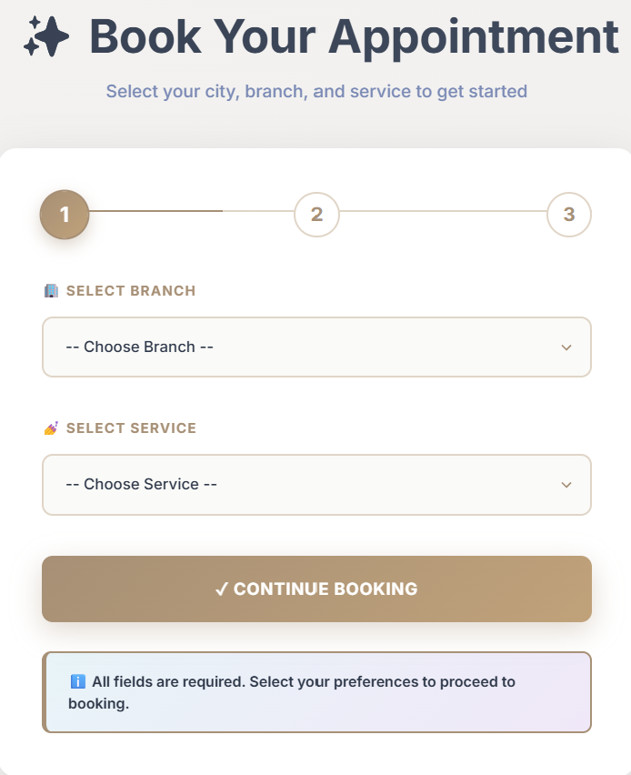
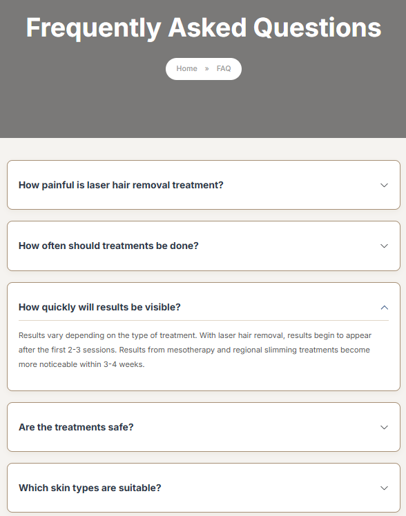
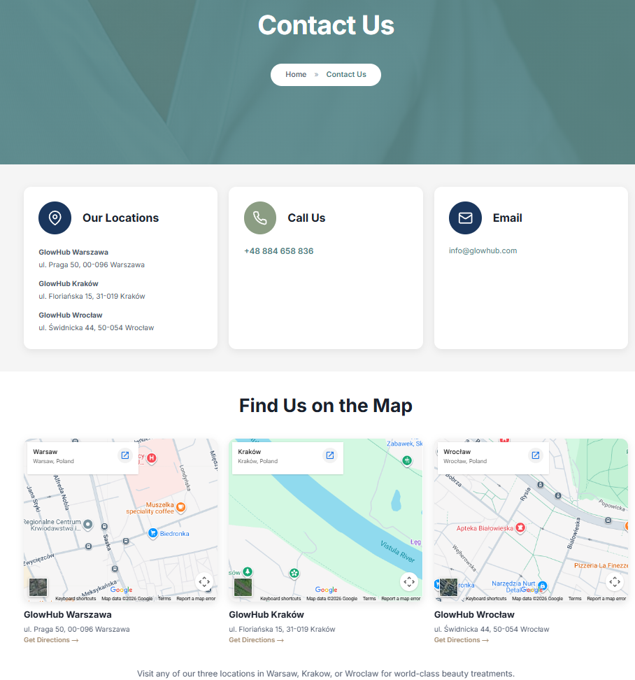
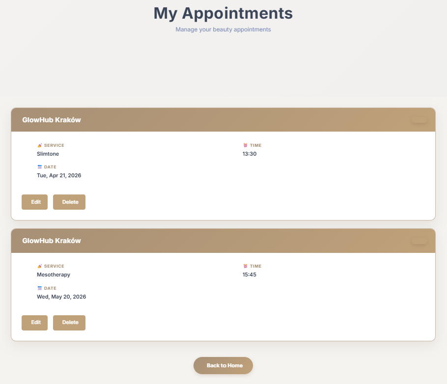
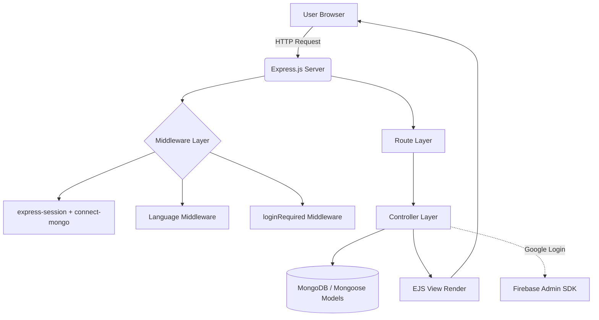
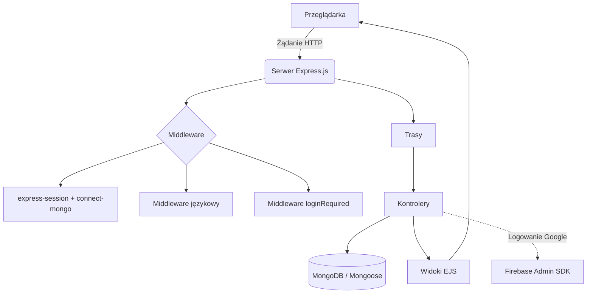

<div align="center">

# ✨ GlowHub — Beauty Center Appointment System

**A full-featured, multilingual appointment booking platform built with Node.js, Express, MongoDB, and EJS.**

Developer: **Aysenur Kiymaz** · VIZJA University, Warsaw · 2026

---

[](https://nodejs.org/)
[](https://expressjs.com/)
[](https://www.mongodb.com/)
[](https://firebase.google.com/)
[](https://getbootstrap.com/)

---

🇬🇧 [English](#-english) · 🇵🇱 [Polski](#-polski)

</div>

---

## 🇬🇧 English

### 📖 Table of Contents

- [About the Project](#-about-the-project)
- [Key Features](#-key-features)
- [Screenshots](#-screenshots)
- [User Roles](#-user-roles)
- [System Architecture](#-system-architecture)
- [Project Structure](#-project-structure)
- [Technologies & Libraries](#-technologies--libraries)
- [Data Models](#-data-models)
- [API / Route Table](#-api--route-table)
- [Setup](#-setup)
- [Environment Variables](#-environment-variables)
- [License](#-license)

---

### 🌸 About the Project

**GlowHub** is a web-based appointment reservation system designed to digitalize branch, service, and appointment management for beauty and aesthetics centers. The platform serves a center operating across three cities in Poland — Warsaw, Kraków, and Wrocław.

Users can browse available time slots by selecting a branch and service, create appointments, edit or cancel existing ones, and sign in via email/password or Google account. The project follows the **MVC (Model-View-Controller)** architecture and provides multilingual content in **English and Polish (EN/PL)**.

| Feature | Description |
|---|---|
| 🧾 Appointment System | Dynamic slot generation per branch & service, conflict control |
| 👤 Authentication | Email/password registration & login + Google sign-in (Firebase) |
| 🌍 Multilingual UI | Session-based language switching (EN/PL) |
| 🏢 Branch Management | Multiple branches, each with their own service catalog |
| 💆 Service Catalog | Dedicated detail pages for 8 beauty services |
| 📝 Blog & Content | Informative blog posts on beauty and skincare topics |
| 📱 Responsive Design | Bootstrap 5 based, mobile-friendly layout |

---

### 🚀 Key Features

- 🔐 **Secure Authentication** — Password hashing with `bcrypt` (10 salt rounds), session-based authentication
- 🔑 **Google Sign-In** — Firebase Authentication integration via popup flow
- 📅 **Smart Appointment System** — Automatic time slot generation based on service duration (09:00–18:00), with booked slots filtered in real time
- 🏬 **Multi-Branch Support** — Each branch has its own address, phone number and service catalog
- 🌐 **Multilingual Structure** — `res.locals.t()` translation function for EN/PL interface texts
- 📖 **Blog Module** — Informative articles on skincare, mesotherapy, lymphatic drainage and more
- 🖼️ **Gallery & FAQ Pages** — Corporate presentation and frequently asked questions
- ⚙️ **Seed Scripts** — Populate branch and service data into the database with a single command
- 🔒 **Double Booking Prevention** — Server-level conflict check using MongoDB `$ne` operator

---

### 🖼️ Screenshots

| Home | Booking |
|:---:|:---:|
|  |  |

| Login / Register | Services |
|:---:|:---:|
|  |  |

| Service Detail | FAQ |
|:---:|:---:|
|  |  |

| Gallery | Contact |
|:---:|:---:|
|  |  |

| My Appointments | - |
|:---:|:---:|
|  | - |

---

### 👥 User Roles

| Role | Access | Permissions |
|---|---|---|
| **Guest** | Without signing in | Browse public pages (home, services, blog, gallery, FAQ, about, contact); register or sign in |
| **Member** | After email/password or Google sign-in | Create appointments, view/edit/cancel personal appointments, access dashboard |

> 💡 **Note:** The `User` data model does not include a `role` field, so there is currently no admin role. To add an admin panel in the future, a `role` field should be added to the `User` model along with an authorization middleware.

---

### ⚙️ System Architecture



**How It Works:**

1. All requests reach the Express server through `app.js`
2. Session data is stored in MongoDB via `express-session` + `connect-mongo`
3. Language is determined from the session; defaults to `en` if not set
4. Appointment-related routes are protected by `loginRequired` middleware
5. Controllers handle all business logic via Mongoose models
6. `utils/slotGenerator.js` calculates available slots; booked ones are filtered out
7. Results are rendered via EJS templates and returned to the browser
8. Google sign-in: Firebase ID token is verified server-side via `firebase-admin`

---

### 📁 Project Structure

```
glow-hub/
├── app.js
├── seed-branches.js
├── seed-services.js
├── config/
│   ├── db.js
│   ├── firebaseConfig.js
│   ├── firebaseServiceAccount.json
│   └── languages.json
├── controllers/
│   ├── authController.js
│   ├── branchController.js
│   ├── serviceController.js
│   └── appointmentController.js
├── middlewares/
│   └── loginRequired.js
├── models/
│   ├── User.js
│   ├── Branch.js
│   ├── Service.js
│   └── Appointment.js
├── routes/
│   ├── authRoutes.js
│   ├── branchRoutes.js
│   ├── serviceRoutes.js
│   ├── appointmentRoutes.js
│   └── pagesRoutes.js
├── utils/
│   └── slotGenerator.js
├── public/
│   ├── css/
│   └── img/
└── views/
    ├── partials/
    ├── services/
    ├── home.ejs, login.ejs, register.ejs, dashboard.ejs
    ├── book-appointment.ejs, appointments.ejs, appointment-edit.ejs
    ├── blog-post-*.ejs
    ├── branches.ejs, faq.ejs, gallery.ejs, contact.ejs, about.ejs
    └── 404.ejs, privacy-policy.ejs, terms-of-service.ejs
```

---

### 🧩 Technologies & Libraries

#### Backend

| Technology | Version | Description |
|---|---|---|
| [Node.js](https://nodejs.org/) | 18+ | Server-side JavaScript runtime |
| [Express.js](https://expressjs.com/) | ^5.2.1 | Web framework for routing and middleware |
| [MongoDB](https://www.mongodb.com/) | — | NoSQL database |
| [Mongoose](https://mongoosejs.com/) | ^9.3.0 | ODM for MongoDB |
| [express-session](https://www.npmjs.com/package/express-session) | ^1.19.0 | User session management |
| [connect-mongo](https://www.npmjs.com/package/connect-mongo) | ^6.0.0 | Persistent session storage in MongoDB |
| [bcrypt](https://www.npmjs.com/package/bcrypt) | ^6.0.0 | Secure password hashing |
| [firebase](https://firebase.google.com/) | ^12.11.0 | Client-side Google authentication |
| [firebase-admin](https://firebase.google.com/docs/admin/setup) | ^13.7.0 | Server-side token verification |
| [method-override](https://www.npmjs.com/package/method-override) | ^3.0.0 | PUT/DELETE support in HTML forms |
| [dotenv](https://www.npmjs.com/package/dotenv) | ^17.3.1 | Environment variable management |

#### Frontend

| Technology | Description |
|---|---|
| [EJS](https://ejs.co/) | Server-side dynamic HTML rendering |
| [Bootstrap 5](https://getbootstrap.com/) (CDN) | Responsive UI components |
| [Font Awesome 6](https://fontawesome.com/) (CDN) | Icon library |
| [Google Fonts](https://fonts.google.com/) (CDN) | Inter, Playfair Display, Lora |

---

### 🗄️ Data Models

**User**

| Field | Type | Description |
|---|---|---|
| name | String | User's name |
| email | String (unique) | Email address |
| password | String | bcrypt-hashed password |
| picture | String | Profile photo (Google sign-in) |
| googleId | String | Google account identifier |
| createdAt | Date | Registration date |

**Branch**

| Field | Type | Description |
|---|---|---|
| name | String | Branch name |
| city | String | City |
| address | String | Address |
| phone | String | Phone number |

**Service**

| Field | Type | Description |
|---|---|---|
| name | String | Service name |
| price | Number | Price |
| duration | Number | Duration (minutes) |
| branch | ObjectId → Branch | Associated branch |

**Appointment**

| Field | Type | Description |
|---|---|---|
| user | ObjectId → User | User who created the appointment |
| service | ObjectId → Service | Selected service |
| branch | ObjectId → Branch | Selected branch |
| date | String | Appointment date |
| time | String | Appointment time |
| status | String | Status (default: confirmed) |

---

### 🔌 API / Route Table

| Method | Endpoint | Description | Access |
|---|---|---|---|
| GET | / | Home page | Public |
| GET / POST | /register | Register | Public |
| GET / POST | /login | Sign in | Public |
| POST | /google-login | Google sign-in | Public |
| GET | /logout | Sign out | Member |
| GET | /dashboard | User dashboard | Member |
| GET | /toggle-language/:lang | Switch UI language | Public |
| GET | /services | Service list | Public |
| GET | /services/:serviceName | Service detail | Public |
| GET | /api/branches | Branch list (JSON) | Public |
| GET | /appointments-book | Booking start page | Member |
| GET / POST | /book/:branchId/:serviceId | Create appointment | Member |
| GET | /appointments | User's appointments | Member |
| GET | /appointments/:id/edit | Edit appointment | Member |
| POST | /appointments/:id/update | Update appointment | Member |
| GET | /appointments/:id/delete | Cancel appointment | Member |
| GET | /slots | Available slots (JSON) | Public |
| GET | /gallery, /faq, /about, /contact | Corporate pages | Public |
| GET | /blog/:slug | Blog posts | Public |

---

### 🛠️ Setup

**Requirements:** Node.js 18+, MongoDB (local or Atlas), npm

```bash
# 1. Clone the repository
git clone https://github.com/Aysenurkiymazz/glow-hub-doc.git
cd glow-hub-doc

# 2. Install dependencies
npm install

# 3. Create .env file

# 4. Add Firebase Admin SDK service account
#    config/firebaseServiceAccount.json

# 5. Seed the database
node seed-branches.js
node seed-services.js

# 6. Start the application
npm run dev
```

App runs at **http://localhost:3000**

---

### 🔐 Environment Variables

```env
MONGO_URI=your_mongodb_connection_string
SESSION_SECRET=your_session_secret
```

---

### 📄 License

This project does not currently include an official license file. Please contact the project owner for usage terms.

---

<br/>

---

## 🇵🇱 Polski

### 📖 Spis treści

- [O projekcie](#-o-projekcie)
- [Najważniejsze funkcje](#-najważniejsze-funkcje)
- [Zrzuty ekranu](#-zrzuty-ekranu)
- [Role użytkowników](#-role-użytkowników)
- [Architektura systemu](#-architektura-systemu)
- [Struktura projektu](#-struktura-projektu)
- [Technologie i biblioteki](#-technologie-i-biblioteki)
- [Modele danych](#-modele-danych)
- [Tabela tras API](#-tabela-tras-api)
- [Instalacja](#-instalacja)
- [Zmienne środowiskowe](#-zmienne-środowiskowe)
- [Licencja](#-licencja-1)

---

### 🌸 O projekcie

**GlowHub** to webowa aplikacja do rezerwacji wizyt, zaprojektowana w celu cyfryzacji zarządzania oddziałami, usługami i rezerwacjami w centrach urody i estetyki. Platforma obsługuje centrum działające w trzech miastach Polski — Warszawie, Krakowie i Wrocławiu.

Użytkownicy mogą przeglądać dostępne terminy, wybierając oddział i usługę, tworzyć rezerwacje, edytować lub anulować istniejące wizyty oraz logować się przez e-mail/hasło lub konto Google. Projekt został zbudowany w architekturze **MVC (Model-View-Controller)** i obsługuje treści w języku **angielskim i polskim (EN/PL)**.

| Funkcja | Opis |
|---|---|
| 🧾 System rezerwacji | Dynamiczne generowanie slotów dla oddziału i usługi, kontrola kolizji |
| 👤 Uwierzytelnianie | Rejestracja/logowanie e-mail + logowanie przez Google (Firebase) |
| 🌍 Wielojęzyczny interfejs | Przełączanie języka na podstawie sesji (EN/PL) |
| 🏢 Zarządzanie oddziałami | Wiele oddziałów, każdy z własnym katalogiem usług |
| 💆 Katalog usług | Dedykowane strony szczegółowe dla 8 zabiegów |
| 📝 Blog i treści | Artykuły informacyjne o urodzie i pielęgnacji skóry |
| 📱 Responsywny design | Oparty na Bootstrap 5, dostosowany do urządzeń mobilnych |

---

### 🚀 Najważniejsze funkcje

- 🔐 **Bezpieczne uwierzytelnianie** — Hashowanie haseł z `bcrypt` (10 rund soli), uwierzytelnianie oparte na sesjach
- 🔑 **Logowanie przez Google** — Integracja z Firebase Authentication
- 📅 **Inteligentny system rezerwacji** — Automatyczne generowanie slotów czasowych (09:00–18:00), zajęte terminy filtrowane w czasie rzeczywistym
- 🏬 **Obsługa wielu oddziałów** — Każdy oddział ma własny adres, telefon i katalog usług
- 🌐 **Struktura wielojęzyczna** — Funkcja tłumaczenia `res.locals.t()` dla interfejsu EN/PL
- 📖 **Moduł bloga** — Artykuły o pielęgnacji skóry, mezoterapii, drenażu limfatycznym i inne
- 🖼️ **Galeria i FAQ** — Prezentacja korporacyjna i często zadawane pytania
- ⚙️ **Skrypty seed** — Załadowanie danych oddziałów i usług jednym poleceniem
- 🔒 **Zapobieganie podwójnym rezerwacjom** — Kontrola kolizji na poziomie serwera z operatorem MongoDB `$ne`

---

### 🖼️ Zrzuty ekranu

| Strona główna | Rezerwacja |
|:---:|:---:|
|  |  |

| Logowanie / Rejestracja | Usługi |
|:---:|:---:|
|  |  |

| Szczegóły usługi | FAQ |
|:---:|:---:|
|  |  |

| Galeria | Kontakt |
|:---:|:---:|
|  |  |

| Moje wizyty | - |
|:---:|:---:|
|  | - |

---

### 👥 Role użytkowników

| Rola | Dostęp | Uprawnienia |
|---|---|---|
| **Gość** | Bez logowania | Przeglądanie publicznych stron; rejestracja i logowanie |
| **Użytkownik** | Po logowaniu e-mail/hasłem lub przez Google | Tworzenie, przeglądanie, edycja i anulowanie własnych wizyt; dostęp do panelu |

> 💡 **Uwaga:** Model danych `User` nie zawiera pola `role`, dlatego nie ma aktualnie roli administratora.

---

### ⚙️ Architektura systemu



**Jak działa aplikacja:**

1. Wszystkie żądania trafiają do serwera Express przez `app.js`
2. Dane sesji są przechowywane w MongoDB przez `express-session` + `connect-mongo`
3. Język jest odczytywany z sesji; domyślnie `en`
4. Trasy rezerwacji są chronione przez middleware `loginRequired`
5. Kontrolery obsługują logikę biznesową przez modele Mongoose
6. `utils/slotGenerator.js` oblicza dostępne sloty; zajęte są filtrowane
7. Wyniki są renderowane przez szablony EJS
8. Logowanie Google: token Firebase weryfikowany przez `firebase-admin`

---

### 📁 Struktura projektu

```
glow-hub/
├── app.js
├── seed-branches.js
├── seed-services.js
├── config/
│   ├── db.js
│   ├── firebaseConfig.js
│   ├── firebaseServiceAccount.json
│   └── languages.json
├── controllers/
│   ├── authController.js
│   ├── branchController.js
│   ├── serviceController.js
│   └── appointmentController.js
├── middlewares/
│   └── loginRequired.js
├── models/
│   ├── User.js
│   ├── Branch.js
│   ├── Service.js
│   └── Appointment.js
├── routes/
│   ├── authRoutes.js
│   ├── branchRoutes.js
│   ├── serviceRoutes.js
│   ├── appointmentRoutes.js
│   └── pagesRoutes.js
├── utils/
│   └── slotGenerator.js
├── public/
│   ├── css/
│   └── img/
└── views/
    ├── partials/
    ├── services/
    ├── home.ejs, login.ejs, register.ejs, dashboard.ejs
    ├── book-appointment.ejs, appointments.ejs, appointment-edit.ejs
    ├── blog-post-*.ejs
    ├── branches.ejs, faq.ejs, gallery.ejs, contact.ejs, about.ejs
    └── 404.ejs, privacy-policy.ejs, terms-of-service.ejs
```

---

### 🧩 Technologie i biblioteki

#### Backend

| Technologia | Wersja | Opis |
|---|---|---|
| [Node.js](https://nodejs.org/) | 18+ | Środowisko uruchomieniowe JavaScript |
| [Express.js](https://expressjs.com/) | ^5.2.1 | Framework webowy |
| [MongoDB](https://www.mongodb.com/) | — | Nierelacyjna baza danych |
| [Mongoose](https://mongoosejs.com/) | ^9.3.0 | ODM dla MongoDB |
| [express-session](https://www.npmjs.com/package/express-session) | ^1.19.0 | Zarządzanie sesjami |
| [connect-mongo](https://www.npmjs.com/package/connect-mongo) | ^6.0.0 | Trwałe przechowywanie sesji |
| [bcrypt](https://www.npmjs.com/package/bcrypt) | ^6.0.0 | Hashowanie haseł |
| [firebase](https://firebase.google.com/) | ^12.11.0 | Uwierzytelnianie Google (klient) |
| [firebase-admin](https://firebase.google.com/docs/admin/setup) | ^13.7.0 | Weryfikacja tokenów (serwer) |
| [method-override](https://www.npmjs.com/package/method-override) | ^3.0.0 | PUT/DELETE w formularzach HTML |
| [dotenv](https://www.npmjs.com/package/dotenv) | ^17.3.1 | Zmienne środowiskowe |

#### Frontend

| Technologia | Opis |
|---|---|
| [EJS](https://ejs.co/) | Dynamiczne generowanie HTML |
| [Bootstrap 5](https://getbootstrap.com/) (CDN) | Responsywne komponenty UI |
| [Font Awesome 6](https://fontawesome.com/) (CDN) | Biblioteka ikon |
| [Google Fonts](https://fonts.google.com/) (CDN) | Inter, Playfair Display, Lora |

---

### 🗄️ Modele danych

**User (Użytkownik)**

| Pole | Typ | Opis |
|---|---|---|
| name | String | Imię |
| email | String (unique) | E-mail |
| password | String | Hasło (bcrypt) |
| picture | String | Zdjęcie profilowe |
| googleId | String | ID konta Google |
| createdAt | Date | Data rejestracji |

**Branch (Oddział)**

| Pole | Typ | Opis |
|---|---|---|
| name | String | Nazwa |
| city | String | Miasto |
| address | String | Adres |
| phone | String | Telefon |

**Service (Usługa)**

| Pole | Typ | Opis |
|---|---|---|
| name | String | Nazwa |
| price | Number | Cena |
| duration | Number | Czas trwania (min) |
| branch | ObjectId → Branch | Oddział |

**Appointment (Rezerwacja)**

| Pole | Typ | Opis |
|---|---|---|
| user | ObjectId → User | Użytkownik |
| service | ObjectId → Service | Usługa |
| branch | ObjectId → Branch | Oddział |
| date | String | Data |
| time | String | Godzina |
| status | String | Status (domyślnie: confirmed) |

---

### 🔌 Tabela tras API

| Metoda | Endpoint | Opis | Dostęp |
|---|---|---|---|
| GET | / | Strona główna | Publiczny |
| GET / POST | /register | Rejestracja | Publiczny |
| GET / POST | /login | Logowanie | Publiczny |
| POST | /google-login | Logowanie przez Google | Publiczny |
| GET | /logout | Wylogowanie | Użytkownik |
| GET | /dashboard | Panel | Użytkownik |
| GET | /toggle-language/:lang | Zmiana języka | Publiczny |
| GET | /services | Lista usług | Publiczny |
| GET | /services/:serviceName | Szczegóły usługi | Publiczny |
| GET | /api/branches | Lista oddziałów (JSON) | Publiczny |
| GET | /appointments-book | Start rezerwacji | Użytkownik |
| GET / POST | /book/:branchId/:serviceId | Tworzenie rezerwacji | Użytkownik |
| GET | /appointments | Wizyty użytkownika | Użytkownik |
| GET | /appointments/:id/edit | Edycja | Użytkownik |
| POST | /appointments/:id/update | Aktualizacja | Użytkownik |
| GET | /appointments/:id/delete | Anulowanie | Użytkownik |
| GET | /slots | Dostępne sloty (JSON) | Publiczny |
| GET | /gallery, /faq, /about, /contact | Strony firmowe | Publiczny |
| GET | /blog/:slug | Blog | Publiczny |

---

### 🛠️ Instalacja

**Wymagania:** Node.js 18+, MongoDB, npm

```bash
# 1. Sklonuj repozytorium
git clone https://github.com/Aysenurkiymazz/glow-hub-doc.git
cd glow-hub-doc

# 2. Zainstaluj zależności
npm install

# 3. Utwórz plik .env

# 4. Dodaj Firebase Admin SDK
#    config/firebaseServiceAccount.json

# 5. Wypełnij bazę danych
node seed-branches.js
node seed-services.js

# 6. Uruchom aplikację
npm run dev
```

Aplikacja działa pod adresem **http://localhost:3000**

---

### 🔐 Zmienne środowiskowe

```env
MONGO_URI=your_mongodb_connection_string
SESSION_SECRET=your_session_secret
```

---

### 📄 Licencja

Projekt nie zawiera jeszcze oficjalnego pliku licencji. W sprawie warunków użycia skontaktuj się z właścicielką projektu.

---

<div align="center">

Made with  by **Aysenur Kiymaz** · VIZJA University, Warsaw · 2026

</div>
