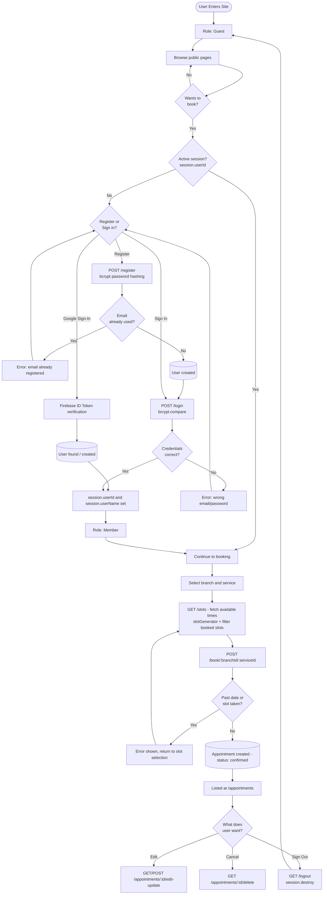
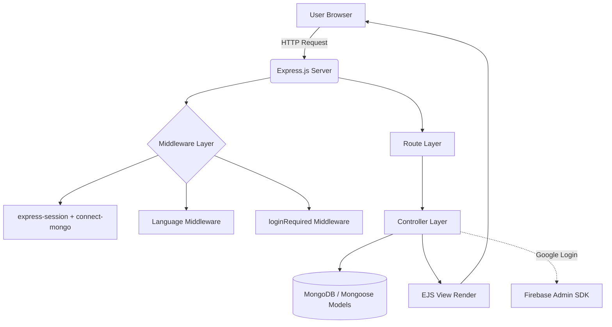

<div align="center">


# ✨ GlowHub — Beauty Center Appointment System

**A full-featured, multilingual appointment booking platform built with Node.js, Express, MongoDB, and EJS.**

Developer: **Aysenur Kiymaz**

</div>

---

## 📖 Table of Contents

- [About the Project](#-about-the-project)
- [Key Features](#-key-features)
- [Screenshots](#-screenshots)
- [User Roles](#-user-roles)
- [System Architecture](#-system-architecture)
- [Project Structure](#-project-structure)
- [Technologies & Libraries](#-technologies--libraries)
- [Data Models](#-data-models)
- [API / Route Table](#-api--route-table)
- [Setup](#-setup)
- [Environment Variables](#-environment-variables)
- [License](#-license)

---

## 🌸 About the Project

**GlowHub** is a web-based appointment reservation system designed to digitalize branch, service, and appointment management for beauty centers. Users can browse available time slots by selecting a branch and service, create appointments, edit or cancel existing ones, and sign in via email/password or Google account.

The project follows the **MVC (Model-View-Controller)** architecture and supports multilingual content in **English and Polish (EN/PL)**.

| Feature | Description |
|---|---|
| 🧾 Appointment System | Dynamic slot generation per branch & service, conflict control |
| 👤 Authentication | Email/password registration & login + Google sign-in (Firebase) |
| 🌍 Multilingual UI | Session-based language switching (EN/PL) |
| 🏢 Branch Management | Multiple branches, each with their own service catalog |
| 💆 Service Catalog | Dedicated detail pages for 8 beauty services |
| 📝 Blog & Content | Informative blog posts on beauty and skincare topics |
| 📱 Responsive Design | Bootstrap 5 based, mobile-friendly layout |

---

## 🚀 Key Features

- 🔐 **Secure Authentication** — Password hashing with `bcrypt`, session-based authentication
- 🔑 **Google Sign-In** — Firebase Authentication integration
- 📅 **Smart Appointment System** — Automatic time slot generation based on service duration, with booked slots filtered out
- 🏬 **Multi-Branch Support** — Each branch has its own address, phone number and services
- 🌐 **Multilingual Structure** — `res.locals.t()` translation function for EN/PL interface
- 📖 **Blog Module** — Informative articles on skincare, mesotherapy, lymphatic drainage and more
- 🖼️ **Gallery & FAQ Pages** — Corporate presentation and frequently asked questions
- ⚙️ **Seed Scripts** — Load branch and service data into the database with a single command

---

## 🖼️ Screenshots

| Home | Booking |
|:---:|:---:|
|  |  |

| Login / Register | Services |
|:---:|:---:|
|  |  |

| Service Detail | FAQ |
|:---:|:---:|
|  |  |

| Gallery | Contact |
|:---:|:---:|
|  |  |

| My Appointments | - |
|:---:|:---:|
|  | - |

---

## 👥 User Roles

The application currently operates with a **single-role structure** — there is no separate admin panel. Roles and their permissions are as follows:

| Role | Access | Permissions |
|---|---|---|
| **Guest** | Without signing in | Browse public pages (home, services, blog, gallery, FAQ, about, contact); register or sign in |
| **Member** | After email/password or Google sign-in | Create appointments, view/edit/cancel personal appointments, access dashboard |

> 💡 **Note:** The `User` data model does not include a `role` field, so there is currently no admin role. To add an admin panel in the future, a `role` field should be added to the `User` model along with an authorization middleware.

### 🔄 User Flow



---

## ⚙️ System Architecture

### General Flow



### How It Works

1. **Request Handling:** All requests reach the Express server through `app.js`.
2. **Session Management:** Session data is stored in MongoDB via `express-session` + `connect-mongo` and passed to all views through `res.locals.session`.
3. **Language Detection:** If no `lang` is set in the session, it defaults to `en`; translations are provided via `res.locals.t()` from `config/languages.json`. Users can switch languages via `/toggle-language/:lang`.
4. **Authorization:** Appointment-related routes are protected by `middlewares/loginRequired.js`; users without `userId` in their session are redirected to `/login`.
5. **Business Logic:** The relevant controller (auth, branch, service, appointment) handles all database operations via Mongoose models.
6. **Slot Generation:** `utils/slotGenerator.js` calculates available time slots based on service duration; `appointmentController.getSlots` filters out already-booked slots for the selected date.
7. **View Rendering:** Result data is passed to EJS templates and rendered as HTML for the user.
8. **Google Sign-In (optional flow):** The Firebase ID token obtained client-side is sent to `/google-login`; it is verified server-side with `firebase-admin`, and the user is found or created in the database.

---

## 📁 Project Structure

```
glow-hub/
├── app.js                     # Application entry point (Express setup, middleware, route registration)
├── seed-branches.js           # Script to seed branch data into the database
├── seed-services.js           # Script to seed service data into the database
│
├── config/
│   ├── db.js                  # MongoDB connection function
│   ├── firebaseConfig.js      # Firebase (client) configuration
│   ├── firebaseServiceAccount.json  # Firebase Admin SDK service account
│   └── languages.json         # Multilingual translation dictionary (EN/PL)
│
├── controllers/
│   ├── authController.js      # Register, login, logout, Google login, dashboard
│   ├── branchController.js    # Branch listing and detail operations
│   ├── serviceController.js   # Service listing operations
│   └── appointmentController.js  # Appointment creation, editing, cancellation, slot calculation
│
├── middlewares/
│   └── loginRequired.js       # Session check middleware
│
├── models/
│   ├── User.js                # User schema
│   ├── Branch.js              # Branch schema
│   ├── Service.js             # Service schema
│   └── Appointment.js         # Appointment schema
│
├── routes/
│   ├── authRoutes.js
│   ├── branchRoutes.js
│   ├── serviceRoutes.js
│   ├── appointmentRoutes.js
│   └── pagesRoutes.js
│
├── utils/
│   └── slotGenerator.js       # Appointment time slot generation algorithm
│
├── public/
│   ├── css/                   # style.css, login-register.css
│   └── img/                   # Images, logo, service/blog cover images
│
└── views/
    ├── partials/              # header.ejs, footer.ejs, appointment-list.ejs
    ├── services/              # 8 service detail pages
    ├── home.ejs, login.ejs, register.ejs, dashboard.ejs
    ├── book-appointment.ejs, appointment-book.ejs, appointment-edit.ejs, appointments.ejs
    ├── blog-post-*.ejs        # 6 blog posts
    ├── branches.ejs, faq.ejs, gallery.ejs, contact.ejs, about.ejs
    └── 404.ejs, privacy-policy.ejs, terms-of-service.ejs
```

---

## 🧩 Technologies & Libraries

### Backend

| Technology | Version | Description |
|---|---|---|
| [Node.js](https://nodejs.org/) | 18+ | Server-side JavaScript runtime |
| [Express.js](https://expressjs.com/) | ^5.2.1 | Web framework for routing and middleware |
| [MongoDB](https://www.mongodb.com/) | — | NoSQL database (users, appointments, services, branches) |
| [Mongoose](https://mongoosejs.com/) | ^9.3.0 | ODM for MongoDB (schema/model management) |
| [express-session](https://www.npmjs.com/package/express-session) | ^1.19.0 | User session management |
| [connect-mongo](https://www.npmjs.com/package/connect-mongo) | ^6.0.0 | Persistent session storage in MongoDB |
| [bcrypt](https://www.npmjs.com/package/bcrypt) | ^6.0.0 | Secure password hashing |
| [firebase](https://firebase.google.com/) | ^12.11.0 | Client-side Google authentication |
| [firebase-admin](https://firebase.google.com/docs/admin/setup) | ^13.7.0 | Server-side Google ID token verification |
| [method-override](https://www.npmjs.com/package/method-override) | ^3.0.0 | PUT/DELETE method support in HTML forms |
| [dotenv](https://www.npmjs.com/package/dotenv) | ^17.3.1 | Environment variable management |

### Frontend

| Technology | Description |
|---|---|
| [EJS](https://ejs.co/) | Server-side dynamic HTML rendering (view engine) |
| [Bootstrap 5](https://getbootstrap.com/) (CDN) | Responsive UI components |
| [Font Awesome 6](https://fontawesome.com/) (CDN) | Icon library |
| [Google Fonts](https://fonts.google.com/) (CDN) | Inter, Playfair Display, Lora typefaces |

### Development Tools

| Tool | Description |
|---|---|
| [nodemon](https://www.npmjs.com/package/nodemon) | Auto-restarts the server on code changes (development only) |

---

## 🗄️ Data Models

**User**

| Field | Type | Description |
|---|---|---|
| name | String | User's name |
| email | String (unique) | Email address |
| password | String | bcrypt-hashed password |
| picture | String | Profile photo (Google sign-in) |
| googleId | String | Google account identifier |
| createdAt | Date | Registration date |

**Branch**

| Field | Type | Description |
|---|---|---|
| name | String | Branch name |
| city | String | City |
| address | String | Address |
| phone | String | Phone number |

**Service**

| Field | Type | Description |
|---|---|---|
| name | String | Service name |
| price | Number | Price |
| duration | Number | Duration (minutes) |
| branch | ObjectId → Branch | Associated branch |

**Appointment**

| Field | Type | Description |
|---|---|---|
| user | ObjectId → User | User who created the appointment |
| service | ObjectId → Service | Selected service |
| branch | ObjectId → Branch | Selected branch |
| date | String | Appointment date |
| time | String | Appointment time |
| status | String | Appointment status (default: `confirmed`) |

---

## 🔌 API / Route Table

| Method | Endpoint | Description | Access |
|---|---|---|---|
| GET | `/` | Home page | Public |
| GET / POST | `/register` | Register | Public |
| GET / POST | `/login` | Sign in | Public |
| POST | `/google-login` | Google sign-in | Public |
| GET | `/logout` | Sign out | Member |
| GET | `/dashboard` | User dashboard | Member |
| GET | `/toggle-language/:lang` | Switch UI language (en/pl) | Public |
| GET | `/services` | Service list | Public |
| GET | `/services/:serviceName` | Service detail page | Public |
| GET | `/branches/:branchId/services` | Branch services | Public |
| GET | `/api/branches` | Branch list (JSON) | Public |
| GET | `/appointments-book` | Booking start page | Member |
| GET / POST | `/book/:branchId/:serviceId` | Create appointment | Member |
| GET | `/appointments` | User's appointments | Member |
| GET | `/appointments/:id/edit` | Edit appointment | Member |
| POST | `/appointments/:id/update` | Update appointment | Member |
| GET | `/appointments/:id/delete` | Cancel appointment | Member |
| GET | `/slots` | Available appointment slots (JSON) | Public |
| GET | `/gallery`, `/faq`, `/about`, `/contact` | Corporate pages | Public |
| GET | `/blog/:slug` | Blog posts (6 total) | Public |
| GET | `/privacy-policy`, `/terms-of-service` | Legal pages | Public |

---

## 🛠️ Setup

### Requirements

- [Node.js](https://nodejs.org/) (v18 or higher)
- [MongoDB](https://www.mongodb.com/) (local or MongoDB Atlas)
- npm

### Steps

```bash
# 1. Clone the repository
git clone https://github.com/<your-username>/glow-hub.git
cd glow-hub

# 2. Install dependencies
npm install

# 3. Create your .env file (see below)

# 4. Add your Firebase Admin SDK service account file
#    as config/firebaseServiceAccount.json

# 5. Seed the database
node seed-branches.js
node seed-services.js

# 6. Start the application
npm run dev
```

The app runs at [http://localhost:3000](http://localhost:3000) by default.

---

## 🔐 Environment Variables

Create a `.env` file in the root directory with the following variables:

```env
MONGO_URI=your_mongodb_connection_string
SESSION_SECRET=your_session_secret
```

Firebase configuration is handled via `config/firebaseConfig.js` (client-side) and `config/firebaseServiceAccount.json` (server-side).

---

## 📄 License

This project does not currently include an official license file. Please contact the project owner for usage terms.

---

<div align="center">

Made with 💛 by **Aysenur Kiymaz**

</div>
