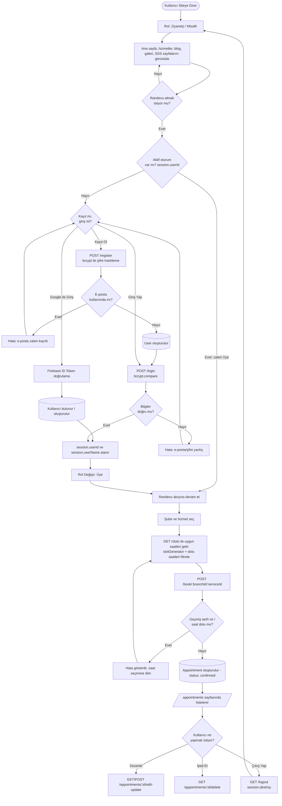
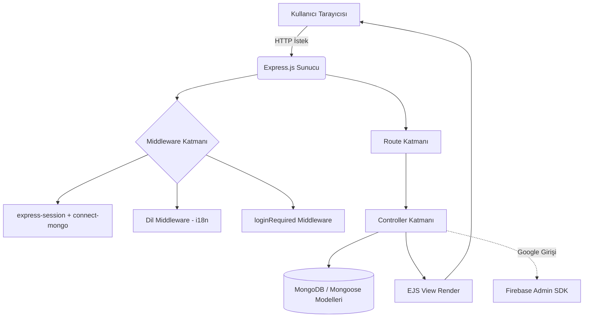

<div align="center">


# ✨ GlowHub — Güzellik Merkezi Randevu Sistemi

**Node.js, Express, MongoDB ve EJS ile geliştirilmiş, çok dilli (TR/EN/PL) tam kapsamlı randevu rezervasyon platformu.**

Geliştirici: **Aysenur**

</div>

---

## 📖 İçindekiler

- [Proje Hakkında](#-proje-hakkında)
- [Öne Çıkan Özellikler](#-öne-çıkan-özellikler)
- [Ekran Görüntüleri](#-ekran-görüntüleri)
- [Kullanıcı Rolleri](#-kullanıcı-rolleri)
- [Sistem Mimarisi ve İşleyişi](#-sistem-mimarisi-ve-işleyişi)
- [Proje Yapısı (Structure)](#-proje-yapısı-structure)
- [Kullanılan Teknolojiler ve Kütüphaneler](#-kullanılan-teknolojiler-ve-kütüphaneler)
- [Veri Modelleri](#-veri-modelleri)
- [API / Route Tablosu](#-api--route-tablosu)
- [Kurulum](#-kurulum)
- [Ortam Değişkenleri](#-ortam-değişkenleri)
- [Yol Haritası](#-yol-haritası)
- [Lisans](#-lisans)
- [English](#english)
- [Polski](#polski)

---

## 🌸 Proje Hakkında

**GlowHub**, güzellik merkezlerinin şube, hizmet ve randevu yönetimini dijitalleştirmek için geliştirilmiş bir **web tabanlı randevu rezervasyon uygulamasıdır**. Kullanıcılar; şube ve hizmet seçerek uygun saat aralıklarını görebilir, randevu oluşturabilir, mevcut randevularını düzenleyebilir/iptal edebilir ve klasik e-posta/şifre ya da Google hesabı ile giriş yapabilir.

Proje **MVC (Model-View-Controller)** mimarisi ile yazılmıştır ve **Türkçe, İngilizce, Lehçe (TR/EN/PL)** olmak üzere çok dilli içerik desteği sunar.

| Özellik | Açıklama |
|---|---|
| 🧾 Randevu Sistemi | Şube + hizmete göre dinamik uygun saat (slot) üretimi, çakışma kontrolü |
| 👤 Kimlik Doğrulama | E-posta/şifre ile kayıt-giriş + Google ile giriş (Firebase) |
| 🌍 Çok Dilli Arayüz | Oturum bazlı dil değiştirme (TR/EN/PL) |
| 🏢 Şube Yönetimi | Birden fazla şube, her şubeye özel hizmet listesi |
| 💆 Hizmet Kataloğu | 8 farklı güzellik hizmeti için detay sayfaları |
| 📝 Blog & İçerik | Güzellik/bakım konularında Türkçe blog yazıları |
| 📱 Responsive Arayüz | Bootstrap 5 tabanlı, mobil uyumlu tasarım |

---

## 🚀 Öne Çıkan Özellikler

- 🔐 **Güvenli Kimlik Doğrulama** — `bcrypt` ile şifre hashleme, oturum tabanlı (session) kimlik doğrulama
- 🔑 **Google ile Giriş** — Firebase Authentication entegrasyonu
- 📅 **Akıllı Randevu Sistemi** — Hizmet süresine göre otomatik saat dilimi (slot) üretimi ve dolu saatleri filtreleme
- 🏬 **Çoklu Şube Desteği** — Her şubenin kendi adresi, telefonu ve sunduğu hizmetler
- 🌐 **Çok Dilli Yapı** — `res.locals.t()` çeviri fonksiyonu ile TR/EN/PL arayüz metinleri
- 📖 **Blog Modülü** — Cilt bakımı, mezoterapi, lenf drenajı gibi konularda bilgilendirici yazılar
- 🖼️ **Galeri & SSS Sayfaları** — Kurumsal tanıtım ve sıkça sorulan sorular
- ⚙️ **Seed Script'leri** — Şube ve hizmet verilerini tek komutla veritabanına yükleme

---

## 🖼️ Ekran Görüntüleri

| Ana Sayfa | Randevu Alma |
|:---:|:---:|
|  |  |

| Giriş / Kayıt | Hizmetler |
|:---:|:---:|
|  |  |

| Hizmet Detay | Soru / Cevap |
|:---:|:---:|
|  |  |

| Galeri | İletişim |
|:---:|:---:|
|  |  |

| Randevularım | - |
|:---:|:---:|
|  | - |

---

## 👥 Kullanıcı Rolleri

Uygulama şu an için **tek roller yapı** üzerine kuruludur; ayrı bir yönetici (admin) paneli bulunmamaktadır. Sistemdeki roller ve yetkileri aşağıdaki gibidir:

| Rol | Erişim Şekli | Yetkiler |
|---|---|---|
| **Ziyaretçi (Misafir)** | Oturum açmadan | Ana sayfa, hizmetler, blog, galeri, SSS, hakkımızda, iletişim sayfalarını görüntüleme; kayıt/giriş yapma |
| **Üye (Kayıtlı Kullanıcı)** | E-posta/şifre veya Google ile giriş yaptıktan sonra | Randevu oluşturma, kendi randevularını görüntüleme/düzenleme/iptal etme, dashboard (panel) erişimi |

> 💡 **Not:** `User` veri modelinde bir `role` alanı bulunmadığından, sistemde şu an bir **admin/yönetici rolü yoktur**. İleride bir yönetim paneli eklenmek istenirse `role` alanının `User` modeline eklenmesi ve yetkilendirme middleware'i yazılması gerekir.

### 🔄 Roller Arası Akış (Algoritma)

Aşağıdaki diyagram, bir kullanıcının **Ziyaretçi** olarak siteye girişinden **Üye**'ye dönüşüp randevu alana kadar izlediği karar akışını gösterir:



**Algoritma adım adım:**

1. **Ziyaretçi girişi** — Kullanıcı herhangi bir kimlik doğrulama olmadan halka açık sayfaları (`/`, `/services`, `/blog/*`, `/gallery`, `/faq`, `/about`, `/contact`) gezebilir.
2. **Randevu isteği tetiklenir** — Ziyaretçi bir hizmete "Randevu Al" dediğinde `loginRequired` middleware'i devreye girer ve `req.session.userId` kontrol edilir.
3. **Oturum yoksa yönlendirme** — Oturum bulunamazsa kullanıcı `/login` sayfasına yönlendirilir; burada **Kayıt Ol**, **Giriş Yap** veya **Google ile Giriş** seçeneklerinden biri izlenir.
4. **Kayıt akışı** — `POST /register`: e-posta benzersizliği kontrol edilir → uygunsa şifre `bcrypt` ile hashlenir ve yeni `User` kaydı oluşturulur → kullanıcı giriş yapmaya yönlendirilir.
5. **Giriş akışı** — `POST /login`: girilen şifre `bcrypt.compare` ile veritabanındaki hash ile karşılaştırılır; eşleşirse `session.userId`/`session.userName` atanarak kullanıcı **Üye** rolüne geçer.
6. **Google ile giriş akışı** — İstemci Firebase üzerinden ID token alır → `/google-login` uç noktasına gönderilir → `firebase-admin` token'ı doğrular → eşleşen kullanıcı bulunur ya da otomatik oluşturulur → oturum açılır.
7. **Üye rolüne geçiş sonrası** — Artık `loginRequired` kontrolünü geçen kullanıcı şube/hizmet seçer, `GET /slots` ile uygun saatleri görür (dolu saatler otomatik filtrelenir) ve `POST /book/:branchId/:serviceId` ile randevu oluşturur.
8. **Çakışma kontrolü** — Sunucu, seçilen tarih geçmişte mi ya da o saat zaten doluysa hatayı döner; aksi halde `Appointment` kaydı `confirmed` durumuyla oluşturulur.
9. **Randevu yönetimi** — Üye, `/appointments` sayfasından kendi randevularını görüntüleyebilir, düzenleyebilir (`/appointments/:id/edit`) veya iptal edebilir (`/appointments/:id/delete`).
10. **Çıkış** — `GET /logout` ile oturum sonlandırılır (`session.destroy()`), kullanıcı tekrar **Ziyaretçi** rolüne döner.

---

## ⚙️ Sistem Mimarisi ve İşleyişi

### Genel Akış



### İşleyiş Adımları

1. **İstek Karşılama:** Tüm istekler `app.js` üzerinden Express sunucusuna ulaşır.
2. **Oturum Yönetimi:** `express-session` + `connect-mongo` ile oturum bilgisi MongoDB'de saklanır; `res.locals.session` aracılığıyla tüm view'lara aktarılır.
3. **Dil Belirleme:** Oturumda `lang` tanımlı değilse varsayılan olarak `pl` atanır; `config/languages.json` sözlüğünden `res.locals.t()` fonksiyonu ile çeviriler view'lara sunulur. Kullanıcı `/toggle-language/:lang` uç noktasıyla dili değiştirebilir.
4. **Yetkilendirme:** Randevu ile ilgili rotalar `middlewares/loginRequired.js` tarafından korunur; oturumda `userId` yoksa kullanıcı `/login` sayfasına yönlendirilir.
5. **İş Mantığı:** İlgili controller (auth, branch, service, appointment) gerekli veritabanı işlemlerini Mongoose modelleri üzerinden yürütür.
6. **Randevu Slot Üretimi:** `utils/slotGenerator.js`, seçilen hizmetin süresine göre uygun saat aralıklarını hesaplar; `appointmentController.getSlots` bu saatleri, o gün için zaten alınmış randevularla karşılaştırıp dolu olanları filtreler.
7. **Görselleştirme:** Sonuç veriler EJS şablonlarına aktarılarak HTML olarak render edilir ve kullanıcıya sunulur.
8. **Google ile Giriş (opsiyonel akış):** İstemci tarafında Firebase Authentication ile alınan ID token, `/google-login` uç noktasına gönderilir; sunucu tarafında `firebase-admin` ile doğrulanır ve kullanıcı veritabanında bulunur/oluşturulur.

---

## 📁 Proje Yapısı (Structure)

```
glow-hub/
├── app.js                     # Uygulama giriş noktası (Express kurulumu, middleware, route bağlama)
├── seed-branches.js           # Şube verilerini veritabanına yükleyen script
├── seed-services.js           # Hizmet verilerini veritabanına yükleyen script
│
├── config/
│   ├── db.js                  # MongoDB bağlantı fonksiyonu
│   ├── firebaseConfig.js      # Firebase (client) yapılandırması
│   ├── firebaseServiceAccount.json  # Firebase Admin SDK servis hesabı
│   └── languages.json         # Çok dilli çeviri sözlüğü (EN/PL)
│
├── controllers/
│   ├── authController.js      # Kayıt, giriş, çıkış, Google girişi, dashboard
│   ├── branchController.js    # Şube listeleme ve detay işlemleri
│   ├── serviceController.js   # Hizmet listeleme işlemleri
│   └── appointmentController.js  # Randevu oluşturma, düzenleme, iptal, slot hesaplama
│
├── middlewares/
│   └── loginRequired.js       # Oturum kontrolü middleware'i
│
├── models/
│   ├── User.js                # Kullanıcı şeması
│   ├── Branch.js               # Şube şeması
│   ├── Service.js               # Hizmet şeması
│   └── Appointment.js          # Randevu şeması
│
├── routes/
│   ├── authRoutes.js
│   ├── branchRoutes.js
│   ├── serviceRoutes.js
│   ├── appointmentRoutes.js
│   └── pagesRoutes.js
│
├── utils/
│   └── slotGenerator.js       # Randevu saat aralığı (slot) üretim algoritması
│
├── public/
│   ├── css/                    # style.css, login-register.css
│   └── img/                    # Görseller, logo, hizmet/blog kapak resimleri
│
└── views/
    ├── partials/               # header.ejs, footer.ejs, appointment-list.ejs
    ├── services/               # 8 hizmet detay sayfası
    ├── home.ejs, login.ejs, register.ejs, dashboard.ejs
    ├── book-appointment.ejs, appointment-book.ejs, appointment-edit.ejs, appointments.ejs
    ├── blog-post-*.ejs         # 6 blog yazısı
    ├── branches.ejs, faq.ejs, gallery.ejs, contact.ejs, about.ejs
    └── 404.ejs, privacy-policy.ejs, terms-of-service.ejs
```

---

## 🧩 Kullanılan Teknolojiler ve Kütüphaneler

### Backend

| Teknoloji | Sürüm | Açıklama |
|---|---|---|
| [Node.js](https://nodejs.org/) | 18+ | Sunucu tarafı JavaScript çalışma ortamı |
| [Express.js](https://expressjs.com/) | ^5.2.1 | Routing ve middleware yönetimi için web framework |
| [MongoDB](https://www.mongodb.com/) | — | NoSQL veritabanı (kullanıcı, randevu, hizmet, şube verileri) |
| [Mongoose](https://mongoosejs.com/) | ^9.3.0 | MongoDB için ODM (şema/model yönetimi) |
| [express-session](https://www.npmjs.com/package/express-session) | ^1.19.0 | Kullanıcı oturum yönetimi |
| [connect-mongo](https://www.npmjs.com/package/connect-mongo) | ^6.0.0 | Oturumların MongoDB üzerinde kalıcı saklanması |
| [bcrypt](https://www.npmjs.com/package/bcrypt) | ^6.0.0 | Şifrelerin güvenli biçimde hash'lenmesi |
| [firebase](https://firebase.google.com/) | ^12.11.0 | İstemci tarafı Google kimlik doğrulama |
| [firebase-admin](https://firebase.google.com/docs/admin/setup) | ^13.7.0 | Sunucu tarafında Google ID token doğrulama |
| [method-override](https://www.npmjs.com/package/method-override) | ^3.0.0 | HTML formlarında PUT/DELETE metod desteği |
| [dotenv](https://www.npmjs.com/package/dotenv) | ^17.3.1 | Ortam değişkenlerinin yönetimi |

### Frontend

| Teknoloji | Açıklama |
|---|---|
| [EJS](https://ejs.co/) | Sunucu tarafında dinamik HTML üretimi (view engine) |
| [Bootstrap 5](https://getbootstrap.com/) (CDN) | Responsive arayüz bileşenleri |
| [Font Awesome 6](https://fontawesome.com/) (CDN) | İkon kütüphanesi |
| [Google Fonts](https://fonts.google.com/) (CDN) | Inter, Playfair Display, Lora yazı tipleri |

### Geliştirme Araçları

| Araç | Açıklama |
|---|---|
| [nodemon](https://www.npmjs.com/package/nodemon) | Kod değişikliklerinde sunucuyu otomatik yeniden başlatma (yalnızca geliştirme ortamı) |

---

## 🗄️ Veri Modelleri

**User**

| Alan | Tip | Açıklama |
|---|---|---|
| name | String | Kullanıcı adı |
| email | String (unique) | E-posta adresi |
| password | String | bcrypt ile hashlenmiş şifre |
| picture | String | Profil fotoğrafı (Google girişinde) |
| googleId | String | Google hesabı kimliği |
| createdAt | Date | Kayıt tarihi |

**Branch (Şube)**

| Alan | Tip | Açıklama |
|---|---|---|
| name | String | Şube adı |
| city | String | Şehir |
| address | String | Adres |
| phone | String | Telefon numarası |

**Service (Hizmet)**

| Alan | Tip | Açıklama |
|---|---|---|
| name | String | Hizmet adı |
| price | Number | Fiyat |
| duration | Number | Süre (dakika) |
| branch | ObjectId → Branch | Bağlı olduğu şube |

**Appointment (Randevu)**

| Alan | Tip | Açıklama |
|---|---|---|
| user | ObjectId → User | Randevuyu oluşturan kullanıcı |
| service | ObjectId → Service | Seçilen hizmet |
| branch | ObjectId → Branch | Seçilen şube |
| date | String | Randevu tarihi |
| time | String | Randevu saati |
| status | String | Randevu durumu (varsayılan: `confirmed`) |

---

## 🔌 API / Route Tablosu

| Metod | Endpoint | Açıklama | Yetki |
|---|---|---|---|
| GET | `/` | Ana sayfa | Herkese açık |
| GET / POST | `/register` | Kayıt ol | Herkese açık |
| GET / POST | `/login` | Giriş yap | Herkese açık |
| POST | `/google-login` | Google ile giriş | Herkese açık |
| GET | `/logout` | Oturumu kapat | Üye |
| GET | `/dashboard` | Kullanıcı paneli | Üye |
| GET | `/toggle-language/:lang` | Arayüz dilini değiştir (en/pl) | Herkese açık |
| GET | `/services` | Hizmet listesi | Herkese açık |
| GET | `/services/:serviceName` | Hizmet detay sayfası | Herkese açık |
| GET | `/branches/:branchId/services` | Şubeye ait hizmetler | Herkese açık |
| GET | `/api/branches` | Şube listesi (JSON) | Herkese açık |
| GET | `/appointments-book` | Randevu başlangıç sayfası | Üye |
| GET / POST | `/book/:branchId/:serviceId` | Randevu oluşturma | Üye |
| GET | `/appointments` | Kullanıcının randevuları | Üye |
| GET | `/appointments/:id/edit` | Randevu düzenleme | Üye |
| POST | `/appointments/:id/update` | Randevu güncelleme | Üye |
| GET | `/appointments/:id/delete` | Randevu iptali | Üye |
| GET | `/slots` | Uygun randevu saatleri (JSON) | Herkese açık |
| GET | `/gallery`, `/faq`, `/about`, `/contact` | Kurumsal sayfalar | Herkese açık |
| GET | `/blog/:slug` | Blog yazıları (6 adet) | Herkese açık |
| GET | `/privacy-policy`, `/terms-of-service` | Yasal sayfalar | Herkese açık |

---

## 🛠️ Kurulum

### Gereksinimler

- [Node.js](https://nodejs.org/) (v18 veya üzeri)
- [MongoDB](https://www.mongodb.com/) (lokal kurulum veya MongoDB Atlas)
- npm

### Adımlar

```bash
# 1. Depoyu klonlayın
git clone https://github.com/<kullanici-adiniz>/glow-hub.git
cd glow-hub

# 2. Bağımlılıkları yükleyin
npm install

# 3. .env dosyanızı oluşturun (aşağıdaki bölüme bakın)

# 4. Firebase Admin SDK servis hesabı dosyanızı
#    config/firebaseServiceAccount.json olarak ekleyin

# 5. Başlangıç verilerini yükleyin
node seed-branches.js
node seed-services.js

# 6. Uygulamayı başlatın
npm run dev
```

Uygulama varsayılan olarak [http://localhost:3000](http://localhost:3000) adresinde çalışır.


---

## 📄 Lisans

Bu proje şu an için resmi bir lisans dosyası içermemektedir. Kullanım koşulları için proje sahibiyle iletişime geçiniz.

---

<div align="center">

Made with 💛 by **Aysenur**

</div>

---

------------------------ EN ------------------------

## English

<div align="center">


# ✨ GlowHub — Beauty Center Appointment System

**A full-featured, multilingual appointment booking platform built with Node.js, Express, MongoDB, and EJS.**

Developer: **Aysenur**

</div>

---

### About the Project

GlowHub is a web-based appointment reservation system designed for beauty centers. It supports branch and service selection, dynamic time-slot generation, appointment creation, appointment management, and authentication through either email/password or Google sign-in.

The project follows an MVC architecture and provides multilingual content in Turkish, English, and Polish.

### Highlights

- Secure authentication with bcrypt and session-based login
- Google sign-in via Firebase Authentication
- Intelligent appointment slot generation with conflict checks
- Multi-branch support with branch-specific service catalogs
- Multilingual UI powered by `res.locals.t()`
- Blog, gallery, FAQ, and corporate pages
- Bootstrap 5 responsive layout

### Screenshots

| Home | Booking |
|:---:|:---:|
|  |  |

| Login / Register | Services |
|:---:|:---:|
|  |  |

| Service Detail | FAQ |
|:---:|:---:|
|  |  |

| Gallery | Contact |
|:---:|:---:|
|  |  |

| My Appointments | - |
|:---:|:---:|
|  | - |

### User Roles

| Role | Access | Permissions |
|---|---|---|
| Guest | Without signing in | Browse public pages, register, and sign in |
| Member | After email/password or Google sign-in | Create, view, update, and cancel personal appointments; access the dashboard |

### Architecture

Request flow: browser → Express middleware → routes → controllers → MongoDB / Mongoose models → EJS views. Session data is stored with `express-session` + `connect-mongo`, and Google authentication is handled through Firebase Admin SDK.

### Project Structure

The repository is organized into `config/`, `controllers/`, `middlewares/`, `models/`, `routes/`, `utils/`, `public/`, and `views/`. The `app.js` file is the application entry point, while seed scripts populate branch and service data.

### Setup

1. Install Node.js 18+ and MongoDB.
2. Run `npm install`.
3. Create your `.env` file.
4. Add the Firebase Admin service account file to `config/firebaseServiceAccount.json`.
5. Run `node seed-branches.js` and `node seed-services.js`.
6. Start the app with `npm run dev`.

### License

No official license file is included yet. Please contact the project owner for usage terms.

---

------------------------ PL ------------------------

## Polski

<div align="center">


# ✨ GlowHub — System rezerwacji wizyt w salonie kosmetycznym

**Kompleksowa, wielojęzyczna platforma rezerwacji wizyt zbudowana w oparciu o Node.js, Express, MongoDB i EJS.**

Twórczyni: **Aysenur**

</div>

---

### O projekcie

GlowHub to webowa aplikacja do rezerwacji wizyt dla salonów kosmetycznych. Umożliwia wybór oddziału i usługi, dynamiczne generowanie dostępnych slotów czasowych, tworzenie i zarządzanie wizytami oraz logowanie przez e-mail/hasło albo konto Google.

Projekt został zbudowany w architekturze MVC i obsługuje treści w języku tureckim, angielskim oraz polskim.

### Najważniejsze funkcje

- Bezpieczne logowanie z bcrypt i sesjami
- Logowanie przez Google z Firebase Authentication
- Inteligentne generowanie slotów i kontrola kolizji terminów
- Obsługa wielu oddziałów i usług przypisanych do oddziałów
- Wielojęzyczny interfejs oparty o `res.locals.t()`
- Blog, galeria, FAQ i strony firmowe
- Responsywny interfejs oparty na Bootstrap 5

### Zrzuty ekranu

| Strona główna | Rezerwacja |
|:---:|:---:|
|  |  |

| Logowanie / Rejestracja | Usługi |
|:---:|:---:|
|  |  |

| Szczegóły usługi | FAQ |
|:---:|:---:|
|  |  |

| Galeria | Kontakt |
|:---:|:---:|
|  |  |

| Moje wizyty | - |
|:---:|:---:|
|  | - |

### Role użytkowników

| Rola | Dostęp | Uprawnienia |
|---|---|---|
| Gość | Bez logowania | Przeglądanie publicznych stron, rejestracja i logowanie |
| Użytkownik | Po logowaniu e-mail/hasłem lub przez Google | Tworzenie, przeglądanie, edycja i anulowanie własnych wizyt; dostęp do panelu |

### Architektura

Przepływ żądań: przeglądarka → middleware Express → routing → kontrolery → modele MongoDB / Mongoose → widoki EJS. Dane sesji są przechowywane przez `express-session` + `connect-mongo`, a logowanie Google obsługuje Firebase Admin SDK.

### Struktura projektu

Repozytorium jest podzielone na katalogi `config/`, `controllers/`, `middlewares/`, `models/`, `routes/`, `utils/`, `public/` i `views/`. Punkt wejścia aplikacji to `app.js`, a skrypty seedowania uzupełniają dane oddziałów i usług.

### Instalacja

1. Zainstaluj Node.js 18+ i MongoDB.
2. Uruchom `npm install`.
3. Utwórz plik `.env`.
4. Dodaj plik konta serwisowego Firebase do `config/firebaseServiceAccount.json`.
5. Uruchom `node seed-branches.js` oraz `node seed-services.js`.
6. Uruchom aplikację poleceniem `npm run dev`.

### Licencja

Projekt nie zawiera jeszcze oficjalnego pliku licencji. W sprawie warunków użycia skontaktuj się z właścicielką projektu.
